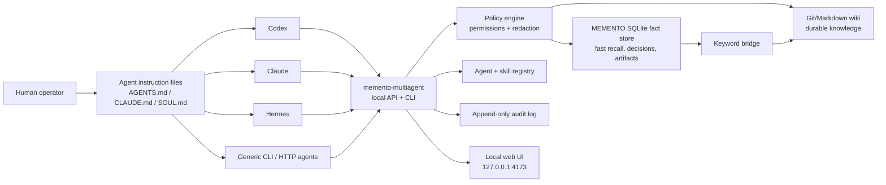

# memento-multiagent

**Multi-agent memory and skill control plane — shared SQLite recall, wiki/WikiLLM bridge, agent instructions, cleanup, and privacy gates. Local-first. No telemetry. No vector DB.**

[](https://www.python.org/)
[](./LICENSE)
[](#dependency-model)
[](#security-model)
[](#connect-agents)

`memento-multiagent` lets several AI agents share memory and skills without forcing them into one framework or cloud backend.

Its main advantage is the browser control plane: a human can open one local web app, see the memory and skills of all connected agents, directly edit or quarantine bad entries, review stale context, and decide what is safe to keep, share, or export.

You do **not** need a VM, server, Kubernetes cluster, or remote agent host. The default setup runs on one local machine: a local MEMENTO store, local agent adapters, and a local browser dashboard bound to `127.0.0.1`.

It is built for the moment when a user stops using one assistant and starts operating a small agent fleet:

- Codex works in the repo;
- Claude handles long reasoning and review;
- Hermes runs persistent workflows;
- OpenClaw-style or CLI agents handle local automation;
- each agent needs the same facts, decisions, skills, and safety rules.

Install it, register agents, paste the generated instruction block into each agent's `AGENTS.md`, `CLAUDE.md`, or `SOUL.md`, and start running a shared agent memory system with a browser UI for human review and control.

```bash
pipx install memento-multiagent
memento-multiagent init
memento-multiagent agent add codex-local --type codex --memory-root ~/.memento --skill-root ~/.codex/skills --instructions ./AGENTS.md
memento-multiagent web
```

```text
http://127.0.0.1:4173/
```

## Works Without A VM

The reference workflow can span VMs and persistent agents, but that is not required.

Local-only mode is the default:

```text
Laptop or desktop
  -> local MEMENTO SQLite/wiki store
  -> local Codex / Claude / CLI agents
  -> local browser dashboard at 127.0.0.1:4173
```

Use a VM only when you want persistent remote agents, always-on automation, or shared team infrastructure. For a personal multi-agent setup, one machine is enough.

## Multi-Device Sharing

Local-only mode is enough when all agents run on one machine. If agents run across several machines, they need a shared reference point.

`memento-multiagent` should support four operating modes:

| Mode | Use when | How it works | Tradeoff |
|---|---|---|---|
| **Local** | one laptop/desktop runs all agents | all memory stays in one local MEMENTO store | simplest and safest |
| **Hub** | agents run on several machines and need shared live memory | one always-on machine hosts the shared MEMENTO store and web UI; clients connect over SSH, Tailscale, HTTP, or MCP | best live sharing, requires one reachable host |
| **GitHub async sync** | you want portable, auditable, multi-machine sharing without running a server | wiki pages, sanitized decisions, skill metadata, and append-only memory logs sync through a private GitHub repo | great for history/review, not ideal for live SQLite writes |
| **Supabase managed hub** | you want multi-device sharing without operating your own VM/server | Supabase stores reviewed events, decisions, skills, cleanup queues, and audit logs; devices keep local SQLite for recall | managed realtime backend, requires cloud account and strict RLS |
| **File-drive sync** | a team already lives in a shared drive | selected exports sync through a provider such as Google Drive | convenient for humans, more conflict-prone for agent writes |

Recommended default:

```text
single machine     -> Local mode
multiple machines  -> Hub mode over Tailscale/SSH
portable history   -> GitHub async sync
managed realtime   -> Supabase managed hub
human file sharing -> Google Drive export only, not the primary memory backend
```

### GitHub Sync

GitHub is a strong option for asynchronous sharing because it gives version history, pull requests, review, issues, releases, and access control.

Best things to sync through GitHub:

- Git/Markdown wiki pages;
- sanitized decisions;
- public or private skill metadata;
- adapter specs;
- docs and examples;
- append-only memory event logs;
- redacted export bundles.

Things that should **not** be synced directly through GitHub by default:

- raw SQLite databases;
- OAuth files;
- API keys or cookies;
- local browser/session state;
- unreviewed audit logs;
- private hostnames or personal records.

GitHub sync does **not** replace SQLite. Each device should keep its own local SQLite store for fast recall. GitHub carries reviewed, text-based sync artifacts that are safe to diff, review, merge, and audit.

Recommended serverless layout:

```text
memory.sqlite3          # local only, fast recall cache/fact store
events/*.jsonl          # GitHub sync, append-only memory events
wiki/*.md               # GitHub sync, durable knowledge
decisions/*.jsonl       # GitHub sync, reviewed decisions
skills/*.json           # GitHub sync, skill metadata
exports/redacted/*.json # GitHub sync, approved export bundles
```

SQLite is excellent as a local fact store, but raw SQLite files are a poor multi-writer sync format. For GitHub sync, prefer append-only logs and import/export snapshots that pass through the redaction gate.

```text
Device A local SQLite
  -> export reviewed append-only events
  -> GitHub repo
  -> Device B imports reviewed events
  -> Device B updates local SQLite
```

This gives serverless sharing without giving up fast local recall:

```text
serverless GitHub mode = local SQLite on every device + GitHub event/wiki/metadata sync
hub mode               = shared live MEMENTO hub + clients
local mode             = one local SQLite/MEMENTO store
```

### Supabase Managed Hub

Supabase can be used as an optional managed hub when you want multi-device or team sharing without operating a VM.

Supabase mode does **not** replace local SQLite. Each device still keeps local SQLite for fast recall. Supabase stores shared, reviewed, append-only control data:

- memory events;
- decisions;
- skill metadata;
- cleanup queue;
- privacy review queue;
- sync status;
- audit log.

Recommended shape:

```text
Device A local SQLite
Device B local SQLite
Device C local SQLite
        |
        v
Supabase managed hub
  memory_events
  decisions
  skills
  cleanup_queue
  privacy_review_queue
  audit_log
        |
        v
Each device imports approved events
and updates local SQLite
```

Supabase is a good fit for:

- near-realtime memory event sharing;
- browser UI auth;
- row-level security;
- review queues;
- audit tables;
- team access control.

Supabase should not store raw secrets or raw local databases:

- no raw `memory.sqlite3`;
- no OAuth tokens;
- no API keys or cookies;
- no SSH private keys;
- no local browser/session state;
- no full transcripts by default.

Recommended role:

```text
Supabase = optional managed realtime hub
SQLite   = fast local recall on every device
Wiki     = durable markdown knowledge
GitHub   = optional source-controlled async sync
```

### Google Drive

Google Drive can be useful for human-facing exports, PDFs, docs, and shared review folders. It is less attractive as the core memory sync backend.

Why it is not the default:

- OAuth setup is heavier;
- file locking and conflict behavior are harder to reason about;
- agent writes can race across machines;
- auditability is weaker than Git commits for text memory;
- Drive is better for documents than append-only operational memory.

Recommended role:

```text
Google Drive = optional export/review target
Supabase     = optional managed realtime hub
GitHub       = optional async source-controlled sync
Hub          = live shared memory
Local        = safest default
```

## Keywords

`multi-agent memory`, `agent memory system`, `shared memory for AI agents`, `Codex memory`, `Claude memory`, `Hermes agent memory`, `OpenClaw`, `AGENTS.md`, `CLAUDE.md`, `SOUL.md`, `SQLite FTS5`, `WikiLLM`, `agent skills`, `skill registry`, `memory cleanup`, `memory pollution`, `local-first AI`, `private agent memory`, `MEMENTO`.

## Related Projects

- **[wmyung/memento](https://github.com/wmyung/memento)** — the lightweight MEMENTO memory core: SQLite fact store, Git/Markdown wiki, keyword bridge, decisions, artifacts, and experiences.
- **[wmyung/memento-multiagent](https://github.com/wmyung/memento-multiagent)** — this optional multi-agent layer: browser control plane, agent registry, skill visibility, cleanup queues, and privacy review.

## Why This Exists

Using several agents creates two problems that single-agent memory tools do not solve well.

### 1. Memory fragmentation

Each agent remembers a different slice of the world:

- one agent knows the repo structure;
- another knows the deployment decision;
- another knows which skill is broken;
- another remembers an old instruction that is no longer true.

The result is repeated context loading, inconsistent behavior, and agents rediscovering the same facts.

### 2. Memory and skill pollution

Long-running agent setups rot:

- stale facts keep getting recalled;
- temporary task context becomes permanent memory;
- duplicated instructions spread across `AGENTS.md`, `CLAUDE.md`, and `SOUL.md`;
- broken or outdated skills stay enabled;
- private paths, hostnames, tokens, or personal context drift toward export;
- one agent writes a rule that helps itself but harms another agent.

`memento-multiagent` treats cleanup as part of the product, not as an afterthought.

## Product Promise

```text
Install anywhere.
Register your agents.
Open the browser control plane.
See and manage every agent's memory and skills.
Paste one instruction block into each agent.
Get shared recall, shared decisions, skill visibility, cleanup queues, and privacy review.
```

The goal is not to create another human note-taking app. The goal is to give humans a control panel for agent memory while making agents behave like they share an operational memory.

## System Design



## Why SQLite Alongside WikiLLM

Wiki-style knowledge is excellent for durable procedures, research notes, and long-form reasoning. But agents also need very fast operational memory: facts, paths, preferences, commands, failures, decisions, artifacts, and skill state.

`memento-multiagent` uses both:

| Layer | Best for | Write policy | Recall speed |
|---|---|---|---|
| **SQLite fact store** | facts, paths, config, preferences, decisions, artifacts, skill state | agents can auto-save concise facts | milliseconds |
| **Wiki / WikiLLM layer** | procedures, explanations, research notes, durable knowledge | ask before creating or editing | slower but deeper |
| **Keyword bridge** | connecting fast facts to deep pages | facts carry wiki references | fast first hop, deep second hop |

Using only a wiki or WikiLLM flow makes every small recall pay the cost of searching or curating long-form knowledge. Adding SQLite gives agents a faster working loop:

```text
SQLite recall first
  -> use the answer immediately if the fact is enough
  -> follow wiki keywords only when deeper context is needed
```

This is not "SQLite instead of WikiLLM." It is **SQLite for fast agent memory plus wiki/WikiLLM for durable knowledge**, wired together for multi-agent operation.

## Design Goals

| Goal | Design choice |
|---|---|
| Shared memory across agents | Agent registry plus common MEMENTO-backed commands |
| Fast routine recall | SQLite/FTS first hop |
| Durable knowledge | Git/Markdown wiki and WikiLLM-compatible workflow |
| No framework lock-in | Adapters for Codex, Claude, Hermes, OpenClaw-style, generic CLI/HTTP |
| Low dependency footprint | Python stdlib runtime and custom no-dependency build backend |
| Safe public sharing | Redaction and export gates before GitHub sync |
| Memory cleanup | stale, duplicate, conflicting, private, orphaned, and agent-local review queues |
| Automatic behavior | generated instruction blocks for agent instruction files |

## Dashboard Design

The web UI is the product's main control surface. It is an operations screen, not a marketing landing page.

Users should be able to:

- see every connected agent in one place;
- browse each agent's memories, decisions, artifacts, and skills;
- directly edit incorrect memory entries;
- quarantine stale, duplicated, risky, or agent-local memory;
- approve durable wiki writes;
- approve or block GitHub/export sync;
- disable broken or outdated skills;
- inspect which agent wrote or used a memory entry.

First viewport:

```text
+------------------------------------------------------------------+
| memento-multiagent                                               |
| Local-first shared memory, skills, cleanup, and privacy review.   |
+-------------------+-------------------+--------------------------+
| Registered agents | Memory health     | Privacy review           |
| Codex / Claude... | stale / duplicate | blocked export items     |
+-------------------+-------------------+--------------------------+
| Agents table: id, type, transport, memory root, skill roots       |
+------------------------------------------------------------------+
| Recent decisions | Skill drift | Cleanup queue | Audit highlights |
+------------------------------------------------------------------+
```

Expected views:

- **Agents**: registered agents, transports, capabilities, instruction files, health.
- **Memory**: facts, categories, keywords, namespaces, age, access counts.
- **Deep Knowledge**: wiki-backed references and keyword bridge status.
- **Decisions**: decision log with rationale and affected agents.
- **Skills**: installed skills, enabled agents, broken/missing/stale skills.
- **Cleanup**: duplicate facts, stale facts, conflicting rules, orphaned skills.
- **Privacy Review**: redaction findings and export blockers.
- **Audit**: agent reads, writes, exports, and policy changes.

## Connect Agents

Every agent is connected through an adapter.

Built-in adapter targets:

- `codex`
- `claude`
- `hermes`
- `openclaw`
- `generic-cli`
- `generic-http`
- `mcp`

Example:

```bash
memento-multiagent agent add codex-local \
  --type codex \
  --memory-root ~/.memento \
  --skill-root ~/.codex/skills \
  --instructions ./AGENTS.md

memento-multiagent agent add claude-local \
  --type claude \
  --memory-root ~/.memento \
  --skill-root ~/.claude/skills \
  --instructions ./CLAUDE.md
```

## What Goes Into AGENTS.md / CLAUDE.md / SOUL.md

For the system to run automatically, each agent must be told when to recall, when to write, and what requires approval.

Generate the block:

```bash
memento-multiagent instructions print --agent codex-local
```

Paste a block like this into the agent's instruction file:

````markdown
## Shared Agent Memory

Use the shared MEMENTO memory through `memento-multiagent`.

- Before non-trivial work, run `memento-multiagent recall "<query>" --agent codex-local`.
- Use `memento-multiagent deep-recall "<query>" --agent codex-local` for prior decisions, operating procedures, and project history.
- Before ending substantial work, save concise facts, decisions, paths, commands, and follow-ups.
- Use `memento-multiagent remember "<fact>" --agent codex-local --category <category> --keywords "<keywords>"` for compact facts.
- Use `memento-multiagent decide "<topic>" "<decision>" --agent codex-local --rationale "<why>"` for decisions.
- Ask before wiki edits, public sync, global skill changes, memory deletion, or changes to another agent's instruction file.
- Never store API keys, OAuth tokens, cookies, SSH private keys, passwords, raw `.env` contents, private records, or full chat transcripts unless explicitly requested.
- Treat memory cleanup as maintenance: mark stale, duplicate, conflicting, or risky entries for review.
````

This instruction block is the key operational detail. Without it, the tool exists but agents will not use it automatically.

## CLI

```bash
memento-multiagent init
memento-multiagent web
memento-multiagent status

memento-multiagent agent add <id> --type <type>
memento-multiagent agent list
memento-multiagent agent doctor <id>

memento-multiagent recall "<query>" --agent <id>
memento-multiagent deep-recall "<query>" --agent <id>
memento-multiagent remember "<fact>" --agent <id> --category <category> --keywords "<keywords>"
memento-multiagent decide "<topic>" "<decision>" --agent <id> --rationale "<why>"
memento-multiagent instructions print --agent <id>
```

To keep data in a project-local directory instead of the default home directory:

```bash
MEMENTO_MULTIAGENT_HOME=.memento-multiagent memento-multiagent status
```

## Security Model

Default stance: **nothing leaves the machine unless the user turns it on.**

| Area | Default |
|---|---|
| Web bind address | `127.0.0.1` |
| Remote API | Off |
| GitHub sync | Off |
| Supabase sync | Off |
| Telemetry | None |
| Public export | Off |
| Wiki write | Human approval |
| Memory delete | Human approval or quarantine first |
| Secrets | Blocked by scanner/review policy |

Before any export or sync, the system should block or queue entries containing:

- API keys, OAuth tokens, cookies, private keys, passwords;
- raw `.env` files or session files;
- private hostnames, SSH aliases, Tailscale names, internal URLs;
- emails, phone numbers, private records, patient/client identifiers;
- full chat transcripts unless explicitly requested.

## Memory And Skill Cleanup

Cleanup classes:

| Class | Meaning |
|---|---|
| `stale` | no longer true or tied to an old project state |
| `duplicate` | same fact repeated in several forms |
| `conflict` | two memories disagree |
| `private` | should not be shared or exported |
| `agent-local` | useful for one agent but harmful globally |
| `skill-drift` | skill exists but instruction files no longer reference it |
| `orphaned` | memory points to a missing file, repo, host, or skill |

Deletion should be conservative. Quarantine first, delete later.

## Dependency Model

The MVP is intentionally small:

- Python standard library runtime;
- no web framework;
- no vector database;
- no Docker requirement;
- no telemetry SDK;
- no mandatory cloud service;
- custom PEP 517 build backend with no build dependencies.

Cloud integrations such as Supabase should be optional extras, not required runtime dependencies.

MEMENTO core remains dependency-light. `memento-multiagent` is an optional operating layer around it.

## Comparison

| Feature | WikiLLM only | MEMENTO only | `memento-multiagent` |
|---|---|---|---|
| Fast fact recall | Partial | Yes | Yes |
| Durable knowledge | Yes | Yes | Yes |
| SQLite + wiki bridge | No | Yes | Yes |
| Multi-agent registry | No | Basic/shared usage | Yes |
| Agent instruction generator | No | Manual | Yes |
| Skill inventory | No | No | Yes |
| Memory pollution cleanup | Manual | Manual | First-class workflow |
| Privacy/export gate | Manual | Manual | Planned/first-class |
| Local-first | Depends | Yes | Yes |
| Framework lock-in | Depends | No | No |

## Status

This repository currently contains a working dependency-light MVP:

- local config;
- agent registry;
- MEMENTO CLI wrapper;
- instruction generator;
- local `127.0.0.1` web dashboard;
- stdlib-only smoke tests;
- no-dependency wheel build backend.

Next layers:

- full cleanup scanner;
- redaction gate;
- skill registry detail pages;
- GitHub export preview;
- optional Supabase managed hub backend;
- richer adapter implementations for Codex, Claude, Hermes, OpenClaw-style agents, and MCP clients.

## GitHub Topics

Recommended repository topics:

```text
ai-agents, agent-memory, multi-agent, memento, codex, claude, hermes, openclaw, sqlite, wikillm, supabase, local-first, agent-skills, memory-cleanup, privacy
```
